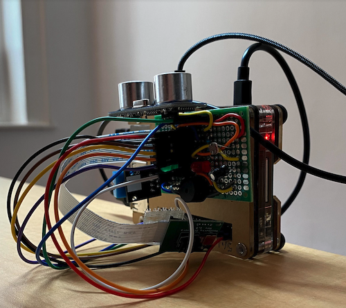
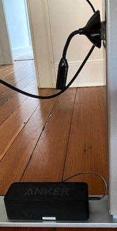

[](https://vimeo.com/429636671 "See it in action.")

### Intro

Click the img above to see this project in [action](https://vimeo.com/429636671).

Uses your raspberry pi to create a disco like environment for your room.

When you run this tool (be activating the SR04 sensor), we enable certain lights
via http requests to the [ifttt](https://ifttt.com/) servers and we run a python script
that analyses the sound in the room and sends UDP packages to an ESP8266 microntroller
that enable the leds on a WS2812B strip.

The script relies on [this](https://github.com/scottlawsonbc/audio-reactive-led-strip) project.
You'll find all you need to get the ESP8266 part of this project up and running. If you
have questions open a ticket and I'll try to help you.

This is very much custom made but it should be easy to modify the code to adjust it to your
needs and desires.

### Hardware

You need:

- A raspberry pi
- An ultrasonic distance sensor
- leds
- ESP8266
- WS2812B LED strip
- usb microphone
- speaker



### Install

```sh
$ git clone git@github.com:drio/musicbox.git
$ cd musicbox
$ make install
```

This will install the necessary packages and other repos. The LED strip visualization
uses the visualization script within [this](https://github.com/scottlawsonbc/audio-reactive-led-strip) project.

You can test the system by running `make party`, it will run a few targets:

- play: loads the [nightmares on wax](https://www.youtube.com/watch?v=uFkqZBAhJ58) performance in using omxplayer.
- cycle_office_table (and others): starts a few lights by making http calls against the [ifttt](https://ifttt.com) servers.
- send_upd: starts the python script that analyzes the sound in the room and sends the udp packages
  to the esp8266.

### Running as a service

Run:

```sh
$ make service/help
```

for details.

### TODO

- I still have to make dynamic a few bits that are currently hardcoded.
- I don't have access to the microphone when the system runs via systemd.
